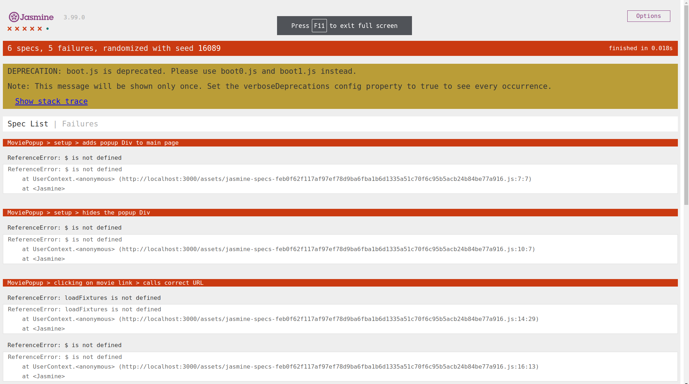

# Actividad Pruebas de AJAX usando Jasmine

Primero necesitamos la gema _jasmine_ en el Gemfile.

```ruby
gem 'jasmine'
```

Ejecutamos `bundle install` para instalar las dependencias. Usando la informacion dada en https://jasmine.github.io/setup/ruby.html

Luego `rails g jasmine:install` para instalar jasmine en el proyecto esto nos crea directorios y archivos como `jasmine.yml` en la que esta la configuracion para las pruebas y `jasmine_helper.rb` para la configuracion del despliegue de Jasmine.

Escribimos `rails jasmine` en la terminal e ingresamos a http://0.0.0.0:8888/, a Jasmine suite bueno al no tener archivos de prueba aparece `0 specs`.

Creamos un archivo de prueba `basic_check_spec.js` en `spec/javascripts` con el siguiente contenido

```javascript
describe("Jasmine basic check", function () {
  it("works", function () {
    expect(true).toBe(true);
  });
});
```

Esta prueba no falla ya que compara entre `true` y otro `true`.


- **Pregunta:** ¿Cuáles son los problemas que se tiene cuando se debe probar Ajax?. Explica tu respuesta.

El manejo de solicitudes asincronas, las pruebas deben de simular y manejar estos eventos para que dichas pruebas se realicen de manera correcta. La manipulación y cambios en el DOM al realizar pruebas AJAX, estas se deben adaptar y simular estos cambios al interactuar con eventos.

- **Pregunta:** ¿Qué son los stubs, espias y fixture en Jasmine para realizar pruebas de Ajax?

  - Stubs : Es una función simulada para reemplazar una función real durante la ejecución de la prueba. Con estos se pueden simular solicitudes AJAX.
  - Spies : Son funciones simuladas que permiten rastrear llamadas, argumentos y comportamientos de una función. Se puede verificar si una función AJAX se ha llamado correctamente y con los parametros esperados.
  - Fixture : Son entornos de prueba para simular las respuestas de una solicitud AJAX, ayuda que las pruebas sean reproducibles.

- **Pregunta:** Experimenta el siguiente código de especificaciones (specs) de Jasmine del camino feliz del código AJAX llamado movie_popup_spec.js.

```javascript
describe("MoviePopup", function () {
  describe("setup", function () {
    it("adds popup Div to main page", function () {
      expect($("#movieInfo")).toExist();
    });
    it("hides the popup Div", function () {
      expect($("#movieInfo")).toBeHidden();
    });
  });
  describe("clicking on movie link", function () {
    beforeEach(function () {
      loadFixtures("movie_row.html");
    });
    it("calls correct URL", function () {
      spyOn($, "ajax");
      $("#movies a").trigger("click");
      expect($.ajax.calls.mostRecent().args[0]["url"]).toEqual("/movies/1");
    });
    describe("when successful server call", function () {
      beforeEach(function () {
        let htmlResponse = readFixtures("movie_info.html");
        spyOn($, "ajax").and.callFake(function (ajaxArgs) {
          ajaxArgs.success(htmlResponse, "200");
        });
        $("#movies a").trigger("click");
      });
      it("makes #movieInfo visible", function () {
        expect($("#movieInfo")).toBeVisible();
      });
      it("places movie title in #movieInfo", function () {
        expect($("#movieInfo").text()).toContain("Casablanca");
      });
    });
  });
});
```

Se crea un archivo en `spec/javascripts` llamada `movie_popup_spec.js` con el contenido anterior. Ejecuto `rails jasmine`



Vemos que las pruebas fallan. No reconoce métodos como `loadFixtures` lo que nos da a entender que faltan los entornos _fixtures_

- **Pregunta** ¿Que hacen las siguientes líneas del código anterior?
  Son un conjunto de pruebas unitarias en Jasmine. `describe('MoviePopup), function()` nos da a entender que son pruebas para el componente MoviePopup en `app/assets/javascripts/movie_popup.js`
  Luego con `describe` inicia pruebas para cada método del componente MoviePopup, como `setup`, probando que el elemento cuya ID sea movieInfo exista y este _invisible_
  Luego para probar la solicitud AJAX usa spyOn, necesitando un fixture y si la URL es `/movies/1` retorna true entonces no falla la prueba.
  Luego cuando ocurre una llamada exitosa, entonces HTTP state code debe ser igual a 200 y el elemento con ID movieInfo debe de ser visible y verificar tambien su contenido.
- ¿Cuál es el papel de spyOn de Jasmine y los stubs en el código dado?
  spyOn y stubs simulan y controlan el comportamiento de ciertas funciones y métodos. Pudiendo verificar y simular ciertos comportamientos y la interaccion entre componentes.

```javascript
it("calls correct URL", function () {
  spyOn($, "ajax");
  $("#movies a").trigger("click");
  expect($.ajax.calls.mostRecent().args[0]["url"]).toEqual("/movies/1");
});
```

- **Pregunta:** ¿Qupe hacen las siguientes líneas del código anterior?.

Primero crea un spy sobre la función AJAX sobre el objeto global $, este spy rastrea el comportamiento de la función AJAX. Luego simula un click en en el enlace con id movies. Finalmente verifica que la llamada de la función AJAX sea igual a la URL `/movies/1`.

```javascript
 let htmlResponse = readFixtures('movie_info.html');
    spyOn($, 'ajax').and.callFake(function(ajaxArgs) {
      ajaxArgs.success(htmlResponse, '200');
    });
    $('#movies a').trigger('click');
  });
  it('makes #movieInfo visible', function() {
    expect($('#movieInfo')).toBeVisible();
  });
  it('places movie title in #movieInfo', function() {
    expect($('#movieInfo').text()).toContain('Casablanca');

```

Primero lee el contenido del fixture `movie_info.html` y lo almacena en _htmlResponse_, luego configura un spy para la funcion AJAX en el objeto global $, y crea una llamada falsa en lugar de la llamad real de AJAX, la llamada falsa simula un escenario exitoso(200). Luego se simula un click. Verfica que el objeto con id movieInfo haya cambiado luego del evento click.

- **Pregunta:** Dado que Jasmine carga todos los ficheros JavaScript antes de ejecutar ningún ejemplo, la llamada a setup (línea 34 del codigo siguiente llamado movie_popup.js)ocurre antes de que se ejecuten nuestras pruebas, comprueba que dicha función hace su trabajo y muestra los resultados.

```javascript
var MoviePopup = {
  setup: function () {
    // add hidden 'div' to end of page to display popup:
    let popupDiv = $('<div id="movieInfo"></div>');
    popupDiv.hide().appendTo($("body"));
    $(document).on("click", "#movies a", MoviePopup.getMovieInfo);
  },
  getMovieInfo: function () {
    $.ajax({
      type: "GET",
      url: $(this).attr("href"),
      timeout: 5000,
      success: MoviePopup.showMovieInfo,
      error: function (xhrObj, textStatus, exception) {
        alert("Error!");
      },
      // 'success' and 'error' functions will be passed 3 args
    });
    return false;
  },
  showMovieInfo: function (data, requestStatus, xhrObject) {
    // center a floater 1/2 as wide and 1/4 as tall as screen
    let oneFourth = Math.ceil($(window).width() / 4);
    $("#movieInfo")
      .css({ left: oneFourth, width: 2 * oneFourth, top: 250 })
      .html(data)
      .show();
    // make the Close link in the hidden element work
    $("#closeLink").click(MoviePopup.hideMovieInfo);
    return false; // prevent default link action
  },
  hideMovieInfo: function () {
    $("#movieInfo").hide();
    return false;
  },
};
$(MoviePopup.setup);
```

Al usar `$(MoviePopup.setup)`, esto se ejecuta cuando el documento esté completamente cargado. Para las pruebas podriamos agregar a las pruebas.

```javascript
beforeEach(function () {
  // Configura el ambiente antes de cada prueba
  loadFixtures("movie_row.html"); // Asegúrate de tener tu archivo de fixture
  $(MoviePopup.setup);
});
```

Para que se carge antes de las pruebas.

- **Pregunta:** Indica cuales son los stubs y fixtures disponibles en Jasmine y Jasmine-jQuery.

En Jasmine se pueden crear stubs usando `jasmine.createSpy()` o `jasmine.createSpyObj()` y tambien `jasmine.createSpy().and.callFake()`
Los fixtures se pueden crear en una carpeta `fixtures` con la extension `html` y con metodos como `loadFixtures()` se pueden cargar datos de prueba y HTML; y con `readFixtures()` se puede leer el contenido del fixture.

- **Pregunta:** Como en RSpec, Jasmine permite ejecutar código de inicialización y desmantelamiento de pruebas utilizando beforeEach y afterEach. El código de inicialización carga el fixture HTML mostrado en el código siguiente, para imitar el entorno que el manejador getMovieInfo vería si fuera llamado después de mostrar la lista de películas.

```javascript
let fixtureHTML;

beforeEach(function () {
  // Carga el fixture HTML antes de cada prueba
  fixtureHTML = '<div id="movies">
  <div class="row">
    <div class="col-8"><a href="/movies/1">Casablanca</a></div>
    <div class="col-2">PG</div>
    <div class="col-2">1943-01-23</div>
  </div>
</div>';
  setFixtures(fixtureHTML);
});

afterEach(function () {
  // limpiar el fixture
});
```

Antes de iniciar las pruebas podriamos colocar el contenido HTML en el fixture y luego de las pruebas con `afterEach` borra el contenido o se restaura el contenido que se ha modificado por las pruebas.


## Ejercicios

1. Un inconveniente de la herencia de prototipos es que todos los atributos (propiedades) de los objetos son públicos. (Recuerda que en Ruby, ningún atributo era público). Sin embargo, podemos aprovechar las clausuras para obtener atributos privados. Crea un sencillo constructor para los objetos User que acepte un nombre de usuario y una contraseña, y proporciona un método checkPassword que indique si la contraseña proporcionada es correcta, pero que deniegue la inspección de la contraseña en sí. Esta expresión de sólo métodos de acceso se usa ampliamente en jQuery.

```javascript
function User(username, password) {
  // Atributos privados utilizando clausuras
  let _username = username;
  let _password = password;

  // Método público para verificar la contraseña
  this.checkPassword = function(inputPassword) {
    return _password === inputPassword;
  };
}

// Ejemplo de uso
let user1 = new User('john_doe', 'secretpassword');
console.log(user1.checkPassword('secretpassword'));
```

2. Supongamos que no puede modificar el código del servidor para añadir la clase CSS adult a las filas de la tabla movies. ¿Cómo identificaría las filas que están ocultas utilizando sólo código JavaScript del lado cliente?

```javascript
let rows = document.querySelectorAll('.rows');

let hiddenRows = Array.from(rows).filter(row => row.classList.contains('adult'));

hiddenRows.forEach(hiddenRow => console.log(hiddenRow));

```

3. Escribe el código AJAX necesario para crear menús en cascada basados en una asociación has_many. Esto es, dados los modelos de Rails A y B, donde A has_many (tiene muchos) B, el primer menú de la pareja tiene que listar las opciones de A, y cuando se selecciona una, devolver las opciones de B correspondientes y rellenar el menú B.


4. Extienda la función de validación en ActiveModel para generar automáticamente código JavaScript que valide las entradas del formulario antes de que sea enviado. Por ejemplo, puesto que el modelo Movie de RottenPotatoes requiere que el título de cada película sea distinto de la cadena vacía, el código JavaScript debería evitar que el formulario Add New Movie se enviara si no se cumplen los criterios de validación, mostrar un mensaje de ayuda al usuario, y resaltar el(los) campo(s) del formulario que ocasionaron los problemas de validación. Gestiona, al menos, las validaciones integradas, como que los títulos sean distintos de cadena vacía, que las longitudes máxima y mínima de la cadena de caracteres sean correctas, que los valores numéricos estén dentro de los límites de los rangos, y para puntos adicionales, realiza las validaciones basándose en expresiones regulares.

Se puede usando la gema *'client_side_validations'*