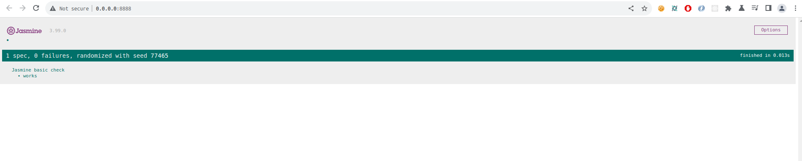
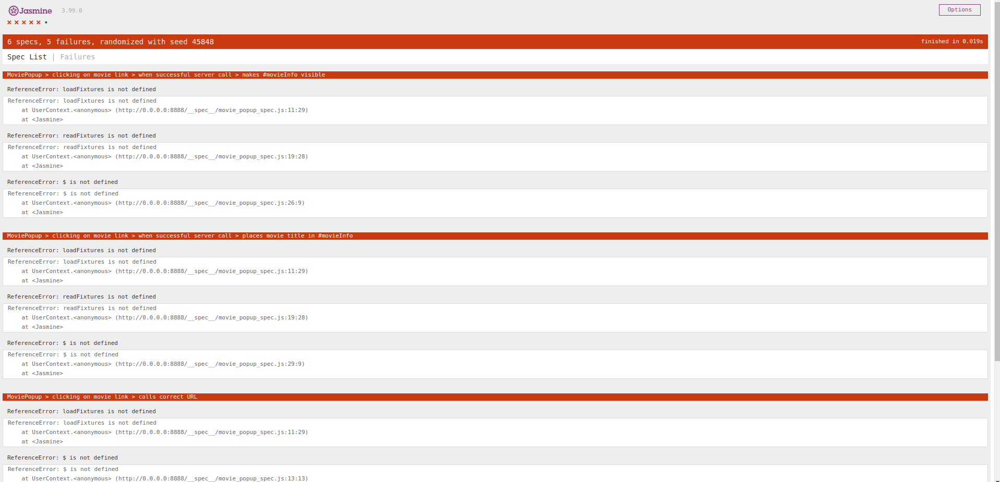

# Actividad Pruebas de AJAX usando Jasmine

Primero necesitamos la gema *jasmine* en el Gemfile.

```ruby
gem 'jasmine'
```

Ejecutamos `bundle install` para instalar las dependencias. Usando la informacion dada en  https://jasmine.github.io/setup/ruby.html

Luego `rails g jasmine:install` para instalar jasmine en el proyecto esto nos crea directorios y archivos como `jasmine.yml` en la que esta la configuracion para las pruebas y `jasmine_helper.rb` para la configuracion del despliegue de Jasmine.

Escribimos `rails jasmine` en la terminal e ingresamos a http://0.0.0.0:8888/, a Jasmine suite bueno al no tener archivos de prueba aparece `0 specs`.

Creamos un archivo de prueba `basic_check_spec.js` en `spec/javascripts` con el siguiente contenido 

```javascript
describe ('Jasmine basic check', function() { 
    it('works', function() { expect(true).toBe(true); }); 
}); 
```
Esta prueba no falla ya que compara entre `true` y otro `true`.



- **Pregunta:** ¿Cuáles son los problemas que se tiene cuando se debe probar Ajax?. Explica tu respuesta.

El manejo de solicitudes asincronas, las pruebas deben de simular y manejar estos eventos para que dichas pruebas se realicen de manera correcta. La manipulación y cambios en el DOM al realizar pruebas AJAX, estas se deben adaptar y simular estos cambios al interactuar con eventos.

- **Pregunta:** ¿Qué son los stubs, espias y fixture en Jasmine para realizar pruebas de Ajax?

    - Stubs : Es una función simulada para reemplazar una función real durante la ejecución de la prueba. Con estos se pueden simular solicitudes AJAX.
    - Spies : Son funciones simuladas que permiten rastrear llamadas, argumentos y comportamientos de una función. Se puede verificar si una función AJAX se ha llamado correctamente y con los parametros esperados.
    - Fixture : Son entornos de prueba para simular las respuestas de una solicitud AJAX, ayuda que las pruebas sean reproducibles.

- **Pregunta:** Experimenta el siguiente código de especificaciones (specs) de Jasmine del camino feliz del código AJAX llamado movie_popup_spec.js.

```javascript 
describe('MoviePopup', function() {
  describe('setup', function() {
    it('adds popup Div to main page', function() {
      expect($('#movieInfo')).toExist();
    });
    it('hides the popup Div', function() {
      expect($('#movieInfo')).toBeHidden();
    });
  });
  describe('clicking on movie link', function() {
    beforeEach(function() { loadFixtures('movie_row.html'); });
    it('calls correct URL', function() {
      spyOn($, 'ajax');
      $('#movies a').trigger('click');
      expect($.ajax.calls.mostRecent().args[0]['url']).toEqual('/movies/1');
    });
    describe('when successful server call', function() {
      beforeEach(function() {
        let htmlResponse = readFixtures('movie_info.html');
        spyOn($, 'ajax').and.callFake(function(ajaxArgs) { 
          ajaxArgs.success(htmlResponse, '200');
        });
        $('#movies a').trigger('click');
      });
      it('makes #movieInfo visible', function() {
        expect($('#movieInfo')).toBeVisible();
      });
      it('places movie title in #movieInfo', function() {
        expect($('#movieInfo').text()).toContain('Casablanca');
      });
    });
  });
});
```

Se crea un archivo en `spec/javascripts` llamada `movie_popup_spec.js` con el contenido anterior. Ejecuto `rails jasmine`



Vemos que las pruebas fallan. No reconoce métodos como `loadFixtures` lo que nos da a entender que faltan los entornos *fixtures* 